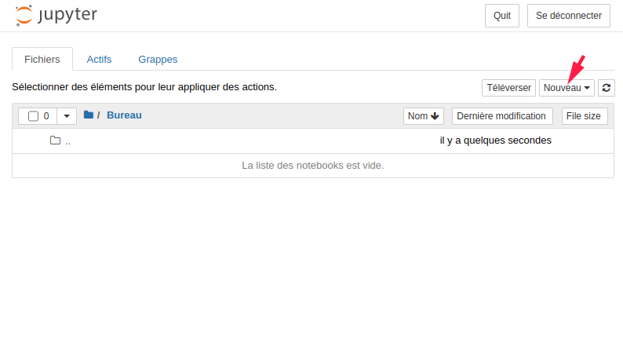
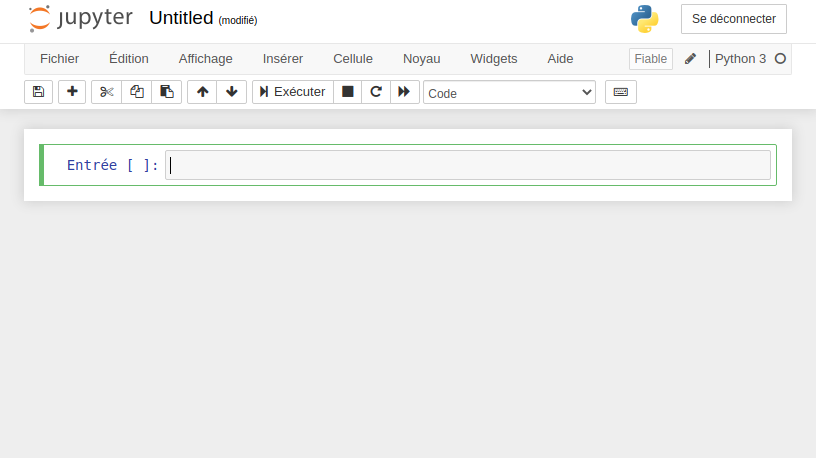

## INTRODUCTION A PANDAS

### INTRODUCTION

Pandas est une librairie python célèbre dans le domaine de la datascience.
Elle est spécialisé dans la gestion, l'analyse et la manipulation des données.
Il est utilisé dans (presque) tous les data-pipelines réalisé en python.

### ENVIRONNEMENT DATA-SCIENCE

Avant de jouer avec pandas parlons de Anaconda (ou miniconda).
C'est l'environnement de datascience du monde python.
Il contient tous les outils necessaire pour installer les librairie, tester nos codes et son déploiement dans différents environnement.

#### INSTALLATION DE MINICONDA

Miniconda est disponible au liens suivants : 
* [raspberry pi](http://repo.continuum.io/miniconda/Miniconda3-latest-Linux-armv7l.sh)
* [linux](https://repo.anaconda.com/miniconda/Miniconda-latest-Linux-x86_64.sh)
* [windows](https://repo.anaconda.com/miniconda/Miniconda-2.2.8-Windows-x86_64.exe)


Lancer ensuite le fichier _.exe_ pour l'installation Windows ou lancer le script d'installation pour l'installation linux.

```bash
chmod +x Miniconda-....sh
sudo ./Miniconda-....sh
```

Tester l'installation :

```
conda --version
```

Si cette commande lève une erreur, intégrez le chemin de conda dans le path.

Identifier la version de python installée 

```
python --version
```

#### INSTALLATION DE JUPYTER

Jupyter est une application Web offrant une interface ergonomique pour programmer dans plus de 40 langages.
Son installation se fait en utilisant la commande conda (ou pip) :
```bash
conda install jupyter 
```

Tester l'installation :
```
jupyter --version
```

Jupyter intègre des outil interressant (`jupyter console`, `jupyter qtconsole`, `jupyter lab` ...) mais le plus interressant et le plus utilisé est surement `jupyter notebook`

#### JUPYTER NOTEBOOK

L'outil ***notebook*** de Jupyter permet de créer des documents intégrant du code directement executable, les résultats, du texte explicatif en markdown, des illustration ...

C'est permet de tester rapidement et facilement un processing et de partager le résultat. C'est donc l'outils parfait pour l'analyse de données.

Lancement de jupyter notebook :
```
jupyter notebook
```

Cette commande lance une web application et ouvre la page suivante :



Nouveau notebook créé:




#### LES ENVIRONNEMENT CONDA

Conda permet d'installer des environnements de développement.

Chaque environnement est séparé des autres et peut contenir des paquets différents ou des version de python différentes.
Lors de l'installation de miniconda un environnement nommé ***base*** est créé, il est considéré comment la configuration global python.

Ces environnements multiples permettent de tester un code dans des configurations différentes ou de tester des librairies multiple sans toucher à la configuration python globale.

La commande `conda` permet de créér et supprimer ces environnements facilement.

##### MANIPULER LES ENVIRONNEMENTS

###### CREATION

Creation d'un environnement nommé ***python2_env*** avec la ***version 2*** de python :

`conda create --name python2_env python=2`

Creation d'un environnement nommé ***python3_env*** avec la ***version 3*** de python.
On intégre l'installation des paquet ***ipykernel*** et ***pandas*** pendant la création. 

`conda create --name python3_env python=3 ipykernel pandas`

###### LISTER LES ENVIRONNEMENT

La commande `conda info --env` permet de lister les environnement et leur path

###### ACTIVER UN ENVIRONNEMENT 

En fonction de l'OS (et de la version de conda) une des commande suivante permet de switcher entre les environnement:
* `source activate nom_environnement`
* `activate nom_environnement`
* `conda activate nom_environnement`

###### SORTIR D'UN ENVIRONNEMENT

En fonction de l'OS (et de la version de conda) une des commande suivante permet de switcher entre les environnement:
* `source deactivate` 
* `deactivate`
* `conda deactivate`


#### LES KERNELS JUPYTER

Jupyter peut de programmer en plus de 40 langages grâce à un systeme de Kernel.
Les kernels sont des environnements d'execution, ce sont eux qui exécute le code intégré dans le notebook pour lui renvoyer le résultat.

Donc pour chacun des environnement créé, on va pouvoir créé un kernel IPython pour l'associer à jupyter notebook.
Ces kernels vont nous permettre d'executer notre code python dans chacun des environnements.

##### IPYKERNEL

Pour lié créer un kernel lié à notre environnement est l'associer à Jupyter, on utilise le module ***ipykernel***.

On l'installe via conda avec les commandes suivantes:

```bash
source activate python3_env #active le virtual env
conda install ipykernel # installation de ipykernel dans le virtual env
```

##### ASSOCIER LE KERNEL AU NOTEBOOK

On utilise le module ***ipykernel*** installé pour lié notre environnement au notebook.

```bash
source activate python3_env
python -m ipykernel install --user --name python3_env --display-name "Python 3 Env"
# installation kernel lie a python3_env nomme Python 3 Env
```

Lors de la prochaine ouverture de `jupyter notebook`, le kernel doit apparaitre dans la liste des kernels diponible

On peut également afficher la liste des kernel associé à python avec la commande :

```bash
jupyter kernelspec list
# RESULTAT
#Python 3 Env    /home/florent/.local/share/jupyter/kernels/python3_env

```


